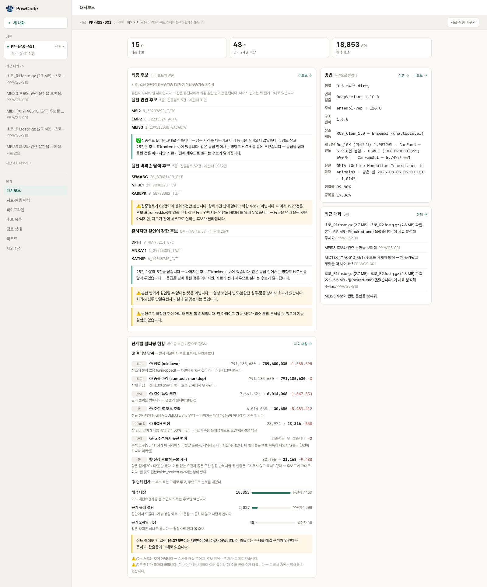

# PawCode 🐾

반려견 전장유전체(WGS)에서 나온 수백만 변이를 검토 가능한 후보군으로 좁히는
프로젝트다. 후보별 주석과 근거, 판정 상태를 한곳에서 확인할 수 있다.

김삼현 · 1인 · 2026.07–2026.08 (4주) · 이어드림스쿨 6기 기업 협업 프로젝트 (피터페터)


---

## 프로젝트 개요

| 항목 | 내용 |
|---|---|
| 기간·인원 | 4주 · 1인 프로젝트 |
| 맡은 범위 | 도메인 조사 · WGS 파이프라인 · 백엔드 · 웹 화면 · AI 에이전트 · 운영 체계 |
| 해결하려는 일 | 분석 실행과 진행 확인, 후보 탐색, 후보별 근거와 문헌 검토 |
| 파이프라인 규모 | 실행 단계 29개 · 기본 리포트 경로 19단계 · 정렬 도구 7종과 변이 검출 도구 비교 |
| 주요 기술 | Python · FastAPI · React · LangGraph · PostgreSQL · Milvus · LangSmith |

원본 파일 등록부터 분석 실행, 후보 목록과 상세 근거, 리포트까지 하나의 웹 제품으로
연결했다. 에이전트는 파이프라인 실행과 결과 탐색을 돕지만 원인 변이나 질환을
확정하지 않는다. 최종 판단은 사용자가 한다.

---

## 분석 실행과 후보 검토

```
결과가 나오기 전
도구 선택 → 환경 구성 → 장시간 실행 → 실패 확인 → 재실행

결과가 나온 뒤
많은 후보 → 서로 다른 근거 확인 → 논문 탐색 → 후보별 검토 기록
```

이번 분석에 사용한 원본 데이터는 압축 파일만 53GB였고 약 8억 개의 리드가 들어
있었다. 정렬에는 2시간 이상이 걸렸고 전장 변이 검출은 20시간을 넘겼다.
여러 단계가 차례로 이어지기 때문에 앞 단계에서 문제가 생기면 긴 작업을 다시 돌려야
했다.

변이 검출이 끝난 뒤에는 후보를 검토해야 했다. 766만 건의 변이에서 후보를 좁혀도
확인할 대상이 수만 건 남았다. 후보마다 집단 빈도와 기능 영향, 보존도를 확인하고
관련 논문도 찾아야 했다.
→ [WGS 데이터와 분석 과제](docs/01-problem-and-context.md)

---

## 사용 흐름

```
사용자
  ↕ 대화와 화면
PawCode
  ├─ 파이프라인 계획·실행·상태 확인
  ├─ 후보 목록·근거·검토 기록
  └─ 문헌과 외부 데이터 조회
```

목표를 말하면 필요한 선행 단계부터 순서대로 실행하고 중단된 작업도 이어서 돌린다.
후보별 선정 근거와 관련 논문, 외부 데이터베이스 조회 결과를 함께 보여준다.
사용자는 이 자료를 보고 원인 후보를 검토한다.

---

## 주요 기능

**분석 파이프라인** — 실행 단계 29개 등록, 기본 리포트 경로 19단계.
정렬 도구 7종과 변이 검출기 2종을 같은 조건에서 비교해 골랐다.
전장 정렬률 99.80%, 평균 깊이 41x, 검출 변이 7,661,621건.

**후보 검토** — 동물 멘델성 변이 판정 지침(AVCG 2024)에 따른 3층 판정,
후보 표 21,168행 전체 열람, 탐색 갈래와 질환 갈래 정렬, 근거 축별 표시와 상충 표시,
검토 상태 기록.

**에이전트** — LangGraph Supervisor와 Greeting Agent, 도구 20종
(실행 제어 · 분석 과정 조회 · 후보 문헌 검토).

**문헌 검색** — 논문 77,531편 색인에 BM25와 벡터 검색을 함께 사용한다. 질의와 색인
규모별로 성능을 측정해 구성을 정했고, 외부 저장소에 연결할 수 없으면 로컬 BM25로 전환한다.

**운영** — 가드레일, LangSmith 추적, promptfoo, 답변 품질 골든셋, 호출 한도,
감사 로그. 각 장치의 역할과 측정 결과는 [AI 가드레일과 운영](docs/06-ai-operations.md)에 있다.

**시험** — 백엔드 625건, 화면 393건.



---

## 도구 선정과 분석 기준

### 도구 비교와 선택

정렬 도구 7종과 변이 검출기 2종을 같은 조건에서 비교하고 선택 기준과 결과를
기록했다. 개 데이터에서는 정확도를 판정할 수 없어 대조 경로도 남겼다.
→ [파이프라인 설계](docs/02-pipeline-design.md)

### 문진 기반 질환 분석

시료마다 다른 질환 정보를 반영할 수 있도록 경로 가중치와 유전자 패널의 하드코딩을
제거했다. 질환 정보는 문진을 입력으로 받는 질환 갈래에 반영하고 분석 구조는
질환과 무관하게 둔다.
→ [후보 선별과 근거 검토](docs/03-candidate-review.md)

### 근거 계열과 중복 처리

후보의 선정 이유와 상충하는 근거를 비교할 수 있도록 각 축을 나란히 표시했다.
같은 성격의 신호를 중복해서 세지 않도록 겹침은 계열 단위로 계산한다.
→ [후보 선별과 근거 검토](docs/03-candidate-review.md)

### 검색 평가와 색인 확장

첫 측정은 질의와 정답에 같은 유전자명이 들어가 BM25에 유리한 조건이었다. 질의를 새로 만들었다.
색인을 30배로 키운 뒤 적중률이 낮아져 임베딩 모델과 검색어 생성 방식을 다시 정했다.
→ [문헌 검색과 평가](docs/05-rag-and-evaluation.md)

---

## 에이전트 역할과 범위

| 역할 | 하는 일 | 하지 않는 일 |
|---|---|---|
| 실행 지원 | 목표를 해석하고 등록된 도구로 계획·실행·상태 조회 | 임의 셸 명령 실행 |
| 분석 과정 설명 | QC·정렬·깊이·필터 산출물을 찾아 연결 | 없는 결과 추정 |
| 후보 검토 | 후보 근거·외부 DB·논문을 찾아 설명 | 원인 변이·질환 확정 |

---

## 문서

| 문서 | 핵심 내용 |
|---|---|
| [WGS 데이터와 분석 과제](docs/01-problem-and-context.md) | 분석 시간과 후보 검토의 어려움 |
| [파이프라인 설계](docs/02-pipeline-design.md) | 도구 비교 · 실행·재개 · 산출물 관리 |
| [후보 선별과 근거 검토](docs/03-candidate-review.md) | 질환별 정렬 · 근거 계열 · 변이 판정 |
| [에이전트 구조](docs/04-agent-architecture.md) | 역할별 도구 · 실행 승인 · 응답 흐름 |
| [문헌 검색과 평가](docs/05-rag-and-evaluation.md) | 평가 설계 · 하이브리드 검색 · 폴백 RAG |
| [AI 가드레일과 운영](docs/06-ai-operations.md) | 출력 규칙 · 품질 평가 · 추적과 호출 한도 |
| [분석 결과 검토](docs/07-decisions-and-lessons.md) | 측정 조건 · 근거 해석 · 집계와 상태 표시 |
| [추가 개발 계획](docs/08-next-steps.md) | 데이터 범위 · 제품 기능 · 운영과 평가 |

---

## 공개 범위

데이터 출처와 공개 범위는 [DISCLOSURE.md](DISCLOSURE.md)에 적었다.
여기 나오는 후보는 원인 변이로 확정되지 않은 검토 대상이며 진단에 쓸 수 없다.
