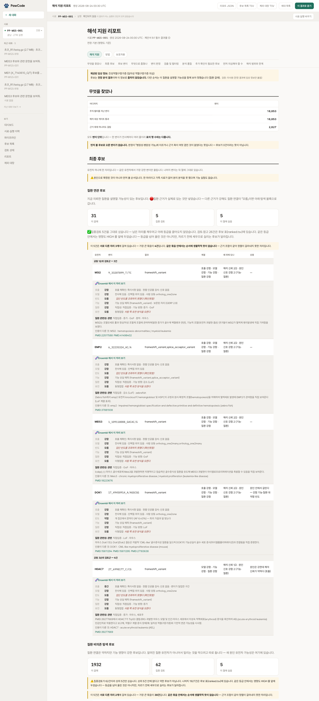

# WGS 데이터와 분석 과제

반려동물 유전자검사 기업 피터페터에서 반려견 한 마리의 전장유전체(WGS) 원시 데이터를
받았다. 유전 질환의 원인을 찾으려고 생성한 자료이다.

## 시료 데이터와 임상 정보

원시 데이터는 압축 파일 53GB, 시퀀싱 리드 약 8억 개였고 질환 관련 정보도 처음부터
함께 전달받았다. 다만 내가 질환 정보 없이 분석해야 하는 것으로 잘못 이해하고 진행했다.

이때 특정 질환을 가정한 경로 가중치와 유전자 패널을 빼고 질환 정보 없이도 실행되는
기본 탐색을 구성했다. 이후 착각을 바로잡고 전달받은 질환 정보를 입력으로 받는 분석을
추가했다. 지금은 문진이 있으면 기본 탐색과 질환별 분석을 함께 돌리고 없으면 기본
탐색만 돌린다.

질환 정보는 입력으로 받으며 분석 구조는 질환과 무관하게 유지한다. 구체적인 구성은
[후보 선별과 근거 검토](03-candidate-review.md)에 있다.

## 분석 시간과 실행 오류

| 단계 | 걸린 시간 |
|---|---|
| 정렬 | 2시간 13분 |
| 중복 마킹 | 1시간 28분 |
| 전장 변이 검출 | 20시간 36분 |

한 단계가 하루 가까이 걸린다. 앞 단계의 설정이 틀리면 그 뒤에 나온 결과를 쓸 수
없지만, 대개 실행이 끝난 뒤에야 알게 된다.

분석 중 겪은 오류는 다음과 같다.

- 낡은 색인 파일 하나 때문에 전장 주석이 통째로 실패했다. 변이 파일을 새로 만들 때
  색인 하나만 갱신하고 다른 형식은 남겨 두었는데, 조회 도구가 남은 쪽을 먼저 읽었다.
  이 경우 오류가 나지 않고 빈 결과가 나온다.
- 구조 변이 검출이 1시간 27분 동안 실행된 뒤 변환 단계에서 실패했다. 단계 등록이
  안 돼 있어서 산출물이 없다는 걸 몰랐다.

매번 상태를 확인하려면 사람이 서버에 접속해 파일을 직접 열어봐야 한다.

## 후보별 근거 확인

변이 766만 건에서 후보를 좁혀도 검토 대상은 18,853 변이(21,168행)이다. 후보 하나를
판단할 때 확인할 정보는 여러 자료에 흩어져 있다.

```
이 변이가 다른 개들에게도 흔한가        → 집단 빈도 자료 (좌표계가 다르다)
단백질 기능을 잃는 자리인가             → 주석 도구 · 구조 예측
종을 넘어 보존된 자리인가               → 보존도 자료
이 유전자와 관련해 개에서 보고된 질환이 있나 → OMIA
사람 문헌에 비슷한 보고가 있나          → 논문 검색
```

자료마다 좌표계와 표기가 다르고 API로 조회한 결과는 파일로 쌓인다. 이를 다루려면
코드를 작성할 수 있어야 하고 결과를 해석하거나 오류를 알아보려면 유전학 지식도 필요하다.

리포트에서는 결론과 근거를 먼저 보여주고 방법과 한계는 뒤에 두었다.



## 실행·검토 기능

분석 실행과 후보 검토를 한곳에서 할 수 있도록 다음 기능을 만들려 했다.

- 목표를 입력하면 필요한 선행 단계부터 실행하고 진행 상태를 보여준다
- 후보가 선정된 근거를 항목별로 보여주고 관련 자료를 함께 제시한다
- 어떤 변이를 원인으로 볼지는 사람이 판단한다
