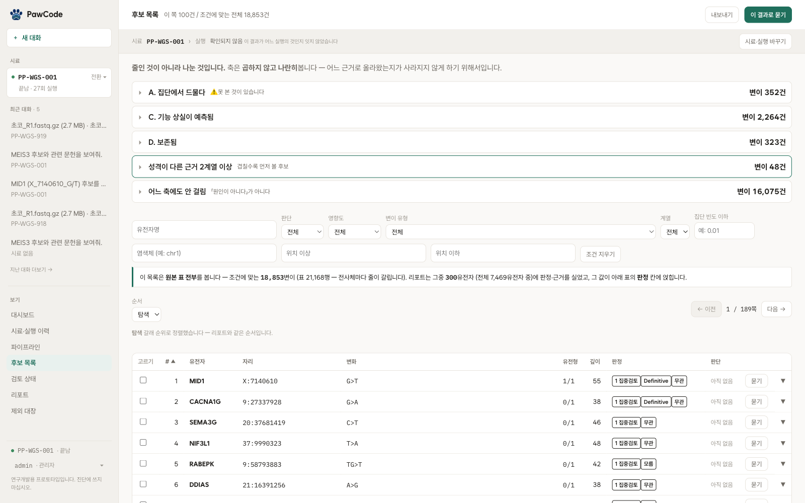
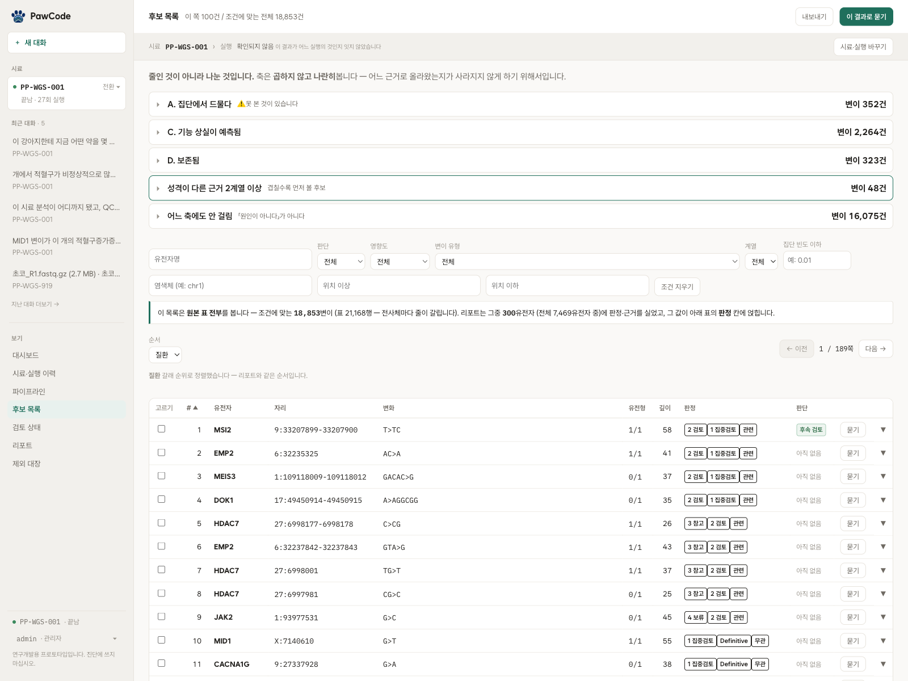
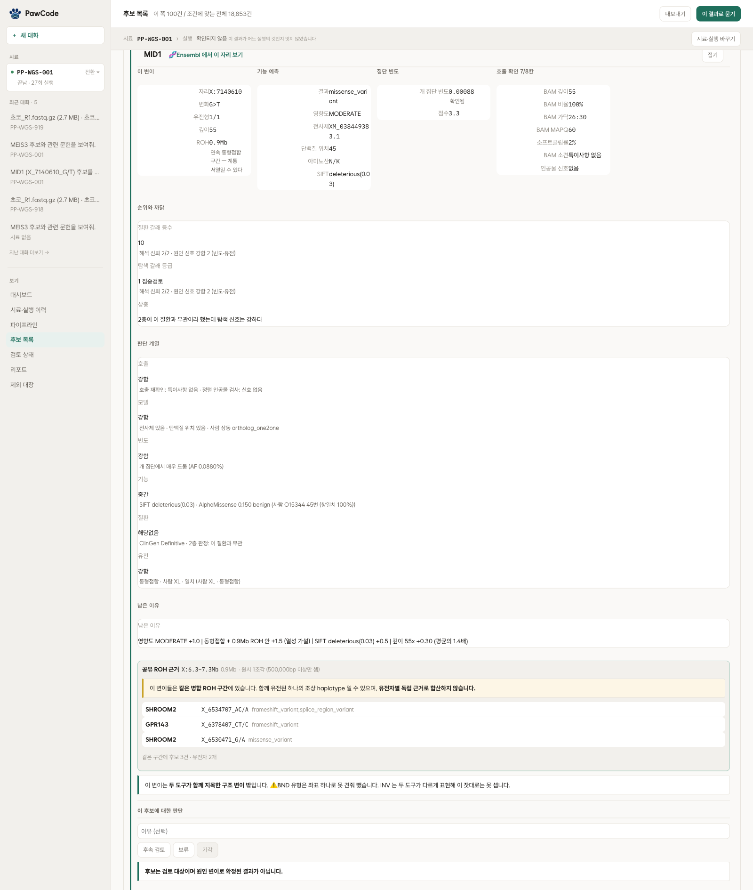
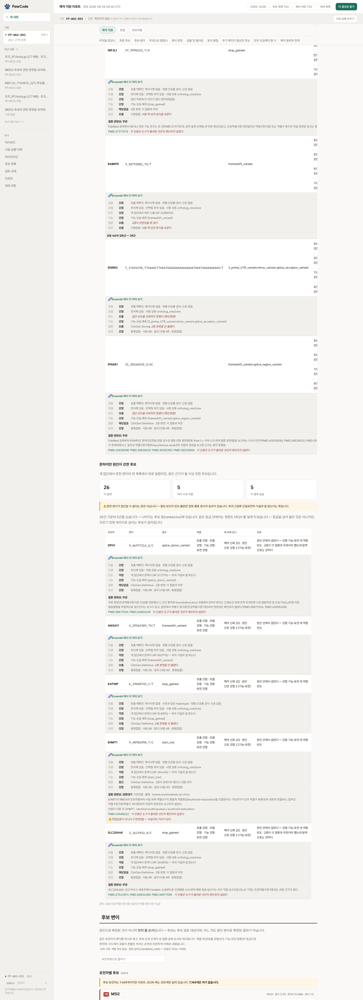
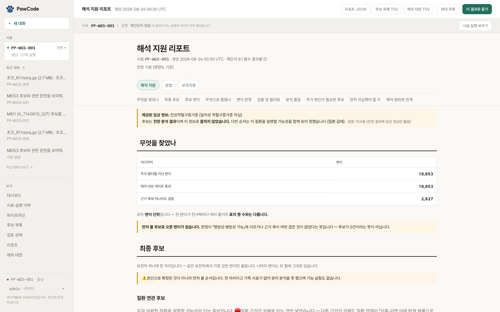
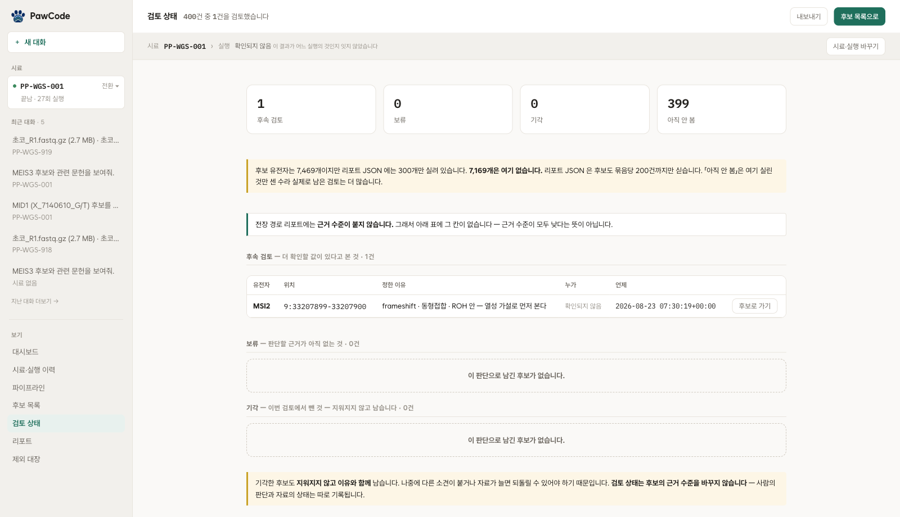

# 후보 선별과 근거 검토

## 질환별 가중치 분리

처음에는 적혈구증가증 관련 유전자 경로에 가중치를 줘서 후보 순서를 정했다.
의뢰받은 질환이 적혈구증가증이어서 당시에는 자연스러운 설계였다.

다음 시료에서는 질환이 달라질 수 있어 가중치를 고정하기 어려웠다. 특정 질환을 코드에
넣어 두면 그 질환과 가까운 후보가 위로 올라가고 해당 시료의 원인 후보는 아래로
밀린다. 실제 데이터에서도 확인했다. 미스센스·HIGH 3,589건 가운데 경로에 걸린
것은 219건이었다. 이 후보들은 적혈구 관련 경로를 기준으로 선택됐으며 실제 원인과의
관련성을 확인한 결과는 아니었다.

그래서 경로 대조와 경로 가중치, 유전자 패널 115개, 유전자별 근거 수준 하드코딩을
전부 뺐다.

질환 관련 정보는 처음부터 받았지만 내가 이를 사용하지 않고 분석해야 하는 것으로
잘못 이해했다. [이 착각을 바로잡은 뒤](01-problem-and-context.md) 질환 정보를 입력으로
받도록 질환별 분석을 다시 넣었다.

```
규칙(구조)   질환 무관   관계 유형 · 근거 계열 · 직접성 판정 · 오탐 2단 검증
내용(자료)   질환 특정   질환명 · 감별진단 · 증상 · 검사 · 발병 · 가족력
                        → 전부 문진에서 온다. 코드에 유전자 이름을 두지 않는다
```

구조는 질환과 무관하게 두고 내용만 문진에서 채운다. 질환이 바뀌면 문진이 바뀌고
그에 따라 시료별 모델이 다시 만들어진다.

문진 유무에 따라 실행 방식이 달라진다.

```
문진이 있으면   탐색 갈래 + 질환 갈래를 함께 실행
문진이 없으면   탐색 갈래만 실행하고, 질환 정보 없이 돌았다고 리포트에 적는다
```

문진이 없을 때는 질환 모델을 만들지 않는다. 리포트에도 질환 정보 없이 분석했음을
표시해 빈칸이 음성 결과로 해석되지 않도록 한다.

탐색 갈래가 쓰는 기준은 어느 질환을 의심하는지와 상관이 없다.

```
집단에서 드문가              개 집단 빈도 1% 미만
기능 상실이 예측되는가       결과 종류 · 영향도
보존된 자리인가              종간 보존도
유전형이 유전 모델과 맞는가  동형접합 여부
```

여러 기준에 걸린 후보를 먼저 검토한다. 다만 기준이 겹친다고 원인이라는 뜻은 아니며
검토 순서일 뿐이라고 리포트에 적었다.

처음에는 "개에서 형질이 보고된 유전자인가"(OMIA 등재)도 정렬 기준에 넣었다가 뺐다.
등재 여부는 이 질환과의 관련성이 아니라 어떤 질환으로든 보고가 있다는 뜻이었다.
OMIA 형질이 붙은 유전자 150개 가운데 혈액·조혈과 관련된 것은 10개였고 나머지 140개는
지금 보는 질환과 무관했다. OMIA 등재 여부를 다른 축과 나란히 놓으면 질환과 무관한
등재 이력도 순위 근거가 된다. OMIA 자체는 참고 정보로 남기고 순위 근거에서는 뺐다.

## 근거 축별 표시



집단 빈도, 기능 상실 예측, 보존도를 따로 표시해 후보가 어떤 근거로 선정됐는지
확인할 수 있게 했다. 성격이 다른 근거가 둘 이상 겹친 후보를 먼저 보게 했다.

```
A. 집단에서 드물다        352
C. 기능 상실이 예측됨   2,264
D. 보존됨                 323
── 2계열 이상             48   ← 겹칠수록 먼저 볼 후보
── 어느 축에도 안 걸림 16,075   ← "원인이 아니다"가 아니다
```

## 근거 계열별 중복 처리

화면에서는 근거를 축별로 보여주지만 겹침은 계열 단위로 센다. 축으로 세면 같은 성격의
신호 두 개를 "근거 둘"로 셀 수 있기 때문이다. 기능 영향 하나를 결과 종류와
보존도로 나눠 두 축에 걸면 근거가 둘로 보이지만 실제로는 하나이다.

그래서 근거를 여섯 계열로 묶고 겹침은 계열 수로 센다.

| 계열 | 묻는 것 |
|---|---|
| 호출 신뢰도 | 이 변이가 리드에서 실제로 보이는가 |
| 모델 신뢰도 | 이 좌표와 전사체·유전자 해석을 믿을 수 있는가 |
| 집단 빈도 | 다른 개 집단에서 얼마나 관찰되는가 |
| 기능 영향 | 변이가 단백질이나 조절 기능을 어떻게 바꾸는가 |
| 질환 연관 | 유전자·변이가 입력 질환과 어떤 관계인가 |
| 유전양식 | 접합 상태와 질환의 유전 방식이 맞는가 |

앞의 둘은 이 해석을 얼마나 믿을 수 있는지를 나타낸다. 뒤의 셋은 원인 후보로 얼마나
맞는지를 보여준다. 집단 빈도는 그 사이에서 희귀성과 관찰 가능성을 확인하는 기준이다.

각 계열에서 실제로 값이 채워진 비율도 계산했다.

```
호출 신뢰도 100%   모델 신뢰도 100%   기능 영향 100%
유전양식   98.7%   집단 빈도  61.9%   질환 연관  18.2%
```

질환 연관이 18.2%인 것은 2층 조회를 돌리지 않은 후보가 많기 때문이고, 집단 빈도
61.9%는 대조하지 못한 자리가 남아 있기 때문이다. 계열마다 값과 측정하지 못한 이유를
함께 남겨 미측정 상태와 음성 결과를 구분한다.

## 탐색·질환별 정렬

같은 후보 목록을 기본 탐색과 질환별 분석 기준으로 각각 정렬할 수 있다. 기준을
바꾸면 순서도 달라진다. 탐색 1위가 질환별 분석에서는 10위로 간다.



기본 탐색은 지금 가진 일반 근거로 넓게 보는 순서이다. 질환별 분석은 문진에서 받은
질환 모델과의 관련성까지 반영한 순서이다. 어느 쪽을 정답으로 두지 않고 사용자가
목적에 따라 정렬 기준을 바꿔 볼 수 있게 했다.

## 3단계 변이 판정

동물 멘델성 변이 판정 지침
([AVCG 2024 원문](https://www.frontiersin.org/journals/veterinary-science/articles/10.3389/fvets.2024.1497817/full))에
따라 등급 판정을 세 단계로 나눴다.

```
1층   이미 계산해 둔 값(보존도·빈도·영향도)으로 기준을 배정하고 결정 트리로 등급
2층   외부 조회가 필요한 기준을 문헌·변이 DB·단백질 정보에서 확인
3층   두 결과를 합쳐 최종 등급
```

2층은 실제로 조회한 인용만 근거로 인정한다. 코드에서 인용 유무를 검사해 근거 없이
기준을 배정하지 못하도록 했다.

변이 7,592건·유전자 4,699개에 모두 적용해 시간과 비용을 쟀다.

| | |
|---|---|
| 시간 | 10시간 3분 (계산은 7분 32초, 나머지는 외부 조회 대기) |
| 재실행 실측 | 후보 1,054행 · 3시간 34분 · 1,452만 토큰 · ₩16,200 |

전체 시간은 비용보다 외부 조회 대기의 영향을 더 많이 받았다. 판정 범위를 근거 축에
걸린 후보로 좁혀도 최종 라벨은 바뀌지 않았다.

## 판정 기준 원문 대조

지침 원문과 구현을 한 줄씩 대조하다가 요건을 일부만 확인하던 기준 네 개를 찾았다.

| 기준 | 원문이 요구하는 것 | 확인하던 것 | 조치 |
|---|---|---|---|
| PM1 | 도메인에 품종·종을 통틀어 양성 변이가 없을 것 | 잔기 하나의 보고 유무 | 트리에서 제외 |
| PP2 | 그 유전자의 양성 미스센스 비율이 낮을 것 | 병원성 보고 건수 | 트리에서 제외 |
| BP3 | 반복 구간이면서 알려진 기능이 없을 것 | 반복 구간인지만 | 조회 판정으로 이동 |
| BP4 | 복수의 계산 근거 | 신호 하나 | 신호 둘 이상일 때만 |

PM1과 PP2는 개 데이터가 없어 트리에서 뺐고 BP3는 확인할 단계를 옮겼다. 자료가
생기면 다시 넣을 수 있도록 판단 근거를 기록에 남겼다.

등급 분포가 이렇게 바뀌었다. 분포는 행 단위(합 7,836행)로 센다. 한 변이가
전사체마다 여러 행이 될 수 있어 위의 변이 수와 그대로 견줄 수 없다.

```
조정 전   VUS 7,721 · LP 4 · LB 111
조정 후   VUS 7,836 · LP 0 · LB 0
```

LB 111행에 적용됐던 근거가 빠졌다. 이 근거는
"양성이라는 근거가 있다"가 아니라 "보존도가 낮고 반복 구간이다"뿐이었다.
수의사가 이를 양성 가능으로 해석하면 검토 대상에서 빼게 된다.

## 동형접합 구간의 연관 후보

7월 31일에 같은 동형접합 구간(ROH) 안의 두 유전자를 각각 독립 근거처럼 상위에 올린
적이 있다. 한 조각으로 함께 물려받은 것이라 독립 근거가 아니다.

같은 ROH 구간의 후보들을 하나의 "공유 사건" 카드로 묶고 카드에
"유전자별 독립 근거로 합산하지 않습니다"라고 명시했다.

구조 변이도 같은 방식이다. 하나의 구조 변이에 포함되거나 그 절단점에 걸린 유전자를
한 사건으로 묶고 검출 도구 둘이 모두 지목했는지를 함께 적는다.



리포트에도 같은 방식으로 실린다. 후보마다 어떤 근거 축에 걸렸는지를 이름과 함께
보여줘 점수의 근거를 확인할 수 있게 했다.



리포트에서 후보표와 제외 대장을 파일로 내보낼 수 있다. 화면에서 본 것과 같은
내용이 그대로 나간다.



## 검토 판단 기록

후보마다 후속 검토·보류·기각을 남기고 판단 이유와 시각을 함께 기록한다.
아직 안 본 것과 기각한 것을 구분해 센다.



## 후보 상세 정보의 결측 처리

후보 목록 전체를 보여주기 전에 어느 열이 얼마나 채워져 있는지 먼저 셌다.

```
후보 목록에 보이는 것   18,853변이 (표 21,168행 — 전사체마다 줄이 갈린다)
리포트가 판정을 실은 것    300유전자 (후보 표 전체 7,469유전자 중)
```

외부 조회가 필요한 2층 판정은 모든 후보에 붙어 있지 않는다. 그래서 상세 정보가 없는
후보는 빈칸으로 두고 후보를 선택하면 그때 판정을 실행하도록 했다.

화면에는 이 두 수를 함께 적었다. 목록은 원본 표 전체지만 판정 결과는 일부 후보에만
있다는 것을 보여줘야 빈칸을 음성 결과로 오해하지 않는다.
