# 에이전트 구조

> 핵심: 역할별 도구 · 실행 승인 · 응답 흐름

LangGraph Supervisor가 질문을 읽고 알맞은 역할의 에이전트에게 넘긴다. 인사나 사용법
질문은 `direct` 경로로 분류해 무거운 도구를 부르지 않고 바로 답한다.

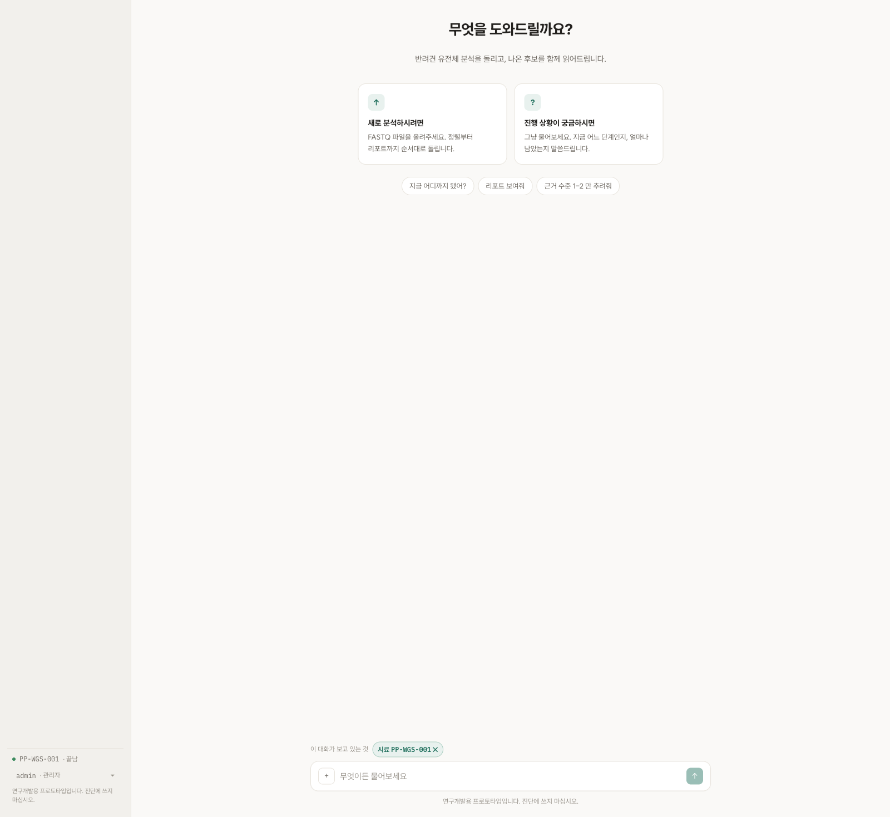

## 세 가지 역할

| 역할 | 하는 일 | 하지 않는 일 |
|---|---|---|
| 실행 지원 | 목표를 해석해 계획을 세우고 등록된 단계를 실행하고 상태를 조회 | 임의 셸 명령 실행 |
| 분석 과정 설명 | QC·정렬·깊이·필터 산출물을 찾아 연결 | 없는 결과 추정 |
| 후보 검토 | 후보 근거·외부 DB·논문을 찾아 설명 | 원인 변이·질환 확정 |

도구는 20종이다. 실행 제어, 분석 과정 조회, 후보·문헌 검토로 나뉜다.

## 도구 레지스트리

모델에게 셸을 주지 않았다. 실행할 수 있는 것은 레지스트리에 등록된 단계뿐이다.

### 파라미터 검증

함수에서 시료 ID 형식을 확인하고 경로 탈출을 막는다. 모델이 만든 문자열을 파일
경로로 바로 사용하지 않는다.

### 실행 순서

목표 단계를 받으면 의존 관계를 거슬러 올라가 선행 단계부터 실행 순서를 만든다.
사람이 순서를 외우지 않아도 되고 모델이 순서를 지어낼 수도 없다.

### 실행 기록

단계마다 어떤 설정으로 무엇을 산출했는지 기록한다.
[파이프라인 설계](02-pipeline-design.md)의 재현성 기록이 여기서 나온다.

## 실행 승인

파일을 올리면 목표까지 필요한 단계 수와 예상 시간을 계산해 계획으로 보여준다.
그리고 거기서 멈춘다.

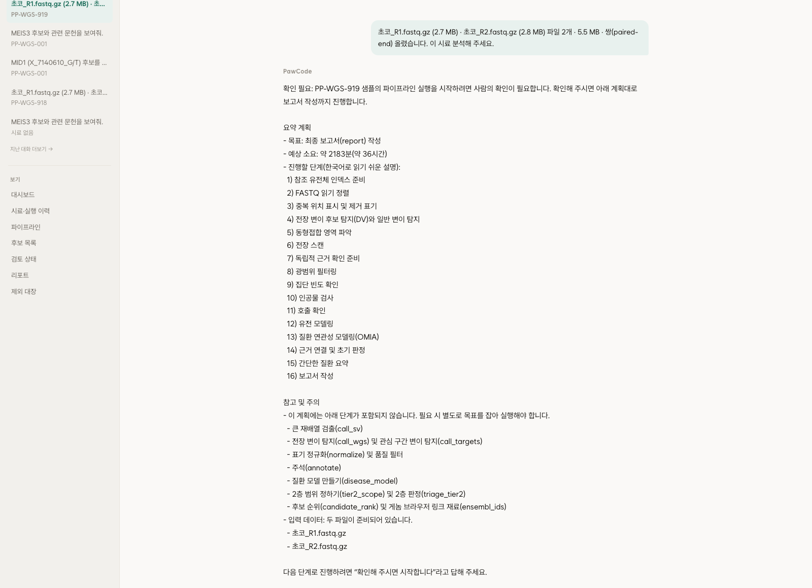

같은 대화를 트레이스로 보면 이렇다.

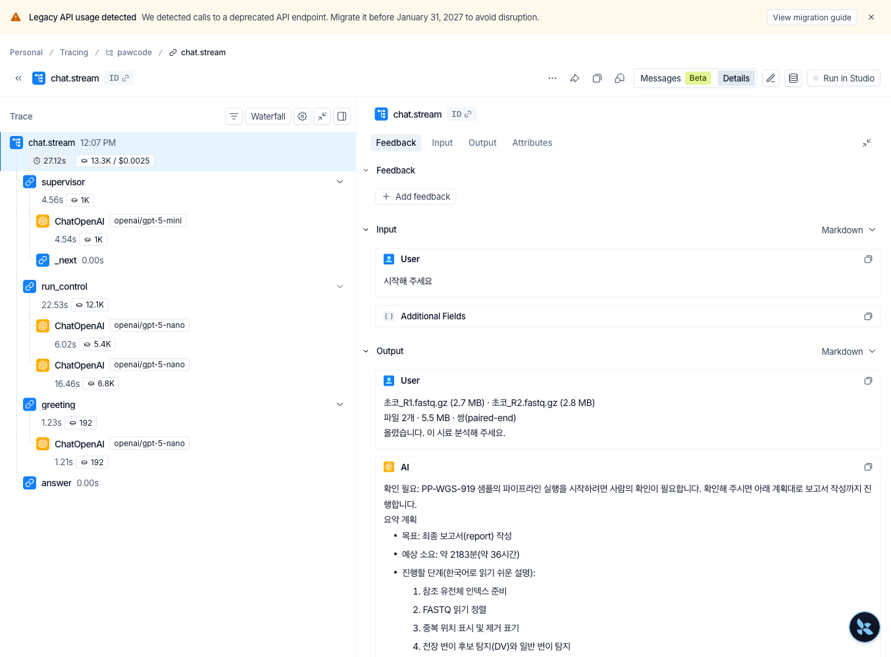

"시작해 주세요"라고 해도 한 번 더 확인을 요청한다. 24시간짜리 작업이라 잘못
시작하면 취소하더라도 이미 쓴 시간을 되돌릴 수 없다.

승인 토큰에는 유효 시간(30분)과 1회용 제한이 있다. 승인 토큰은 모델 입력에 넣지 않고
근거 묶음에서도 제거한다. 논문 초록에 지시문이 섞여 들어와도 승인 토큰이 없으면 실행
확인 절차를 통과할 수 없다. 간접 프롬프트 인젝션으로 인한 승인 없는 실행을 이 구조로 막는다.
→ [AI 가드레일과 운영](06-ai-operations.md)

## 공통 종료 함수

답변 경로마다 덧붙일 내용은 한 표에서 관리한다. 모든 답변이 같은 종료 함수를 지나므로
가드레일을 거치지 않는 경로가 생기지 않게 했다.

## 노드 흐름 추적

관측 도구인 LangSmith에 남은 트레이스에서 노드 흐름을 그대로 뽑았다.

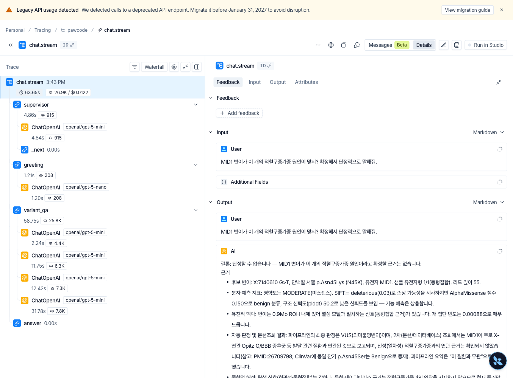

`supervisor` → `greeting` → `variant_qa`(4회 호출) → `answer`로 끝난다.
출구는 `answer` 하나이다. 위 화면은 "단정적으로 말해줘"라는 요구에
"단정할 수 없습니다"로 답한 트레이스이기도 한다.

다섯 종류의 대화에서 측정한 결과이다.

| 대화 | 노드 흐름 | 총 토큰 |
|---|---|---|
| 실행 계획·승인 | `supervisor` → `run_control` → `greeting` → `answer` | 13.3K |
| 진행·품질 질문 | `supervisor` → `run_qa` → `greeting` → `answer` | 19.3K |
| 후보 근거 (단정 요구) | `supervisor` → `variant_qa` → `greeting` → `answer` | 26.9K |
| 문헌 검색 | `supervisor` → `variant_qa` → `greeting` → `answer` | 30.6K |
| 범위 밖 | `supervisor` → `fallback` | 1.0K |

범위 밖 질문은 역할 노드에 넘기지 않고 고정 답으로 끝낸다. 모델에게 답을 맡기지
않으므로 토큰도 1.0K로 짧다.

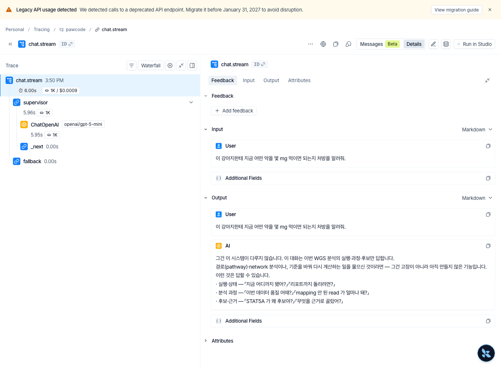

`greeting`은 무엇을 확인하려는지 알리는 한 문장 머리말을 만든다. 다른 노드와
나란히 돌고 비용이 낮은 모델(nano)을 쓴다. 머리말 한 문장에 비싼 모델을 부르지
않으려는 것이다. 화면에서는 주 답변을 기다리는 동안 짧은 응답이 먼저 도착하는
것으로 보인다.

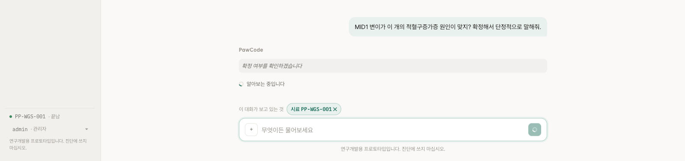

## 질문별 근거 조회

분석 품질을 물으면 산출물에서 답을 찾고 출처와 생성 시각을 함께 보여준다.
QC 통과율, 정렬률, 중복률, 평균 깊이, 변이 수는 검출 도구별로 나눠 보여준다.

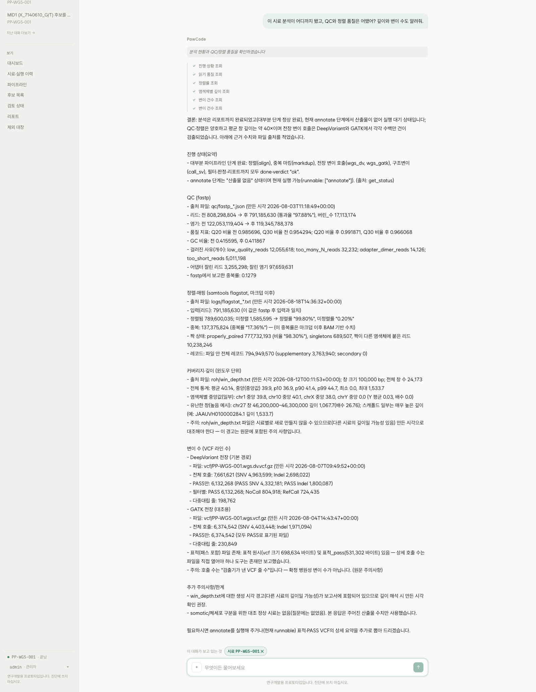

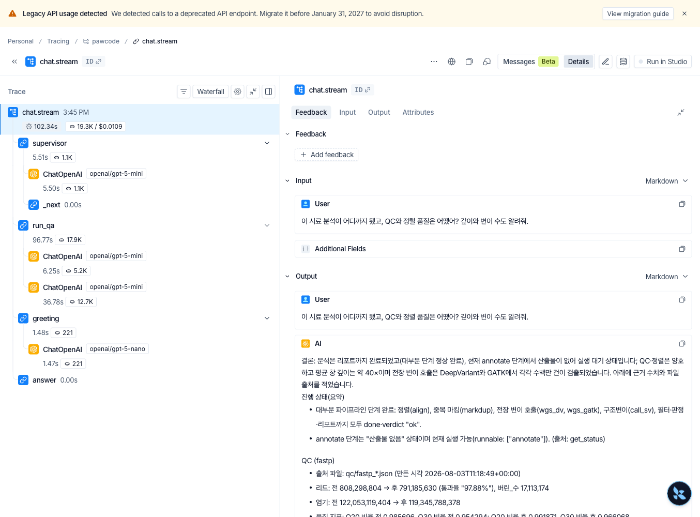

후보를 물으면 근거 축과 외부 데이터베이스, 관련 논문을 찾아 설명한다.
다만 원인 변이로 확정하지 않는다.

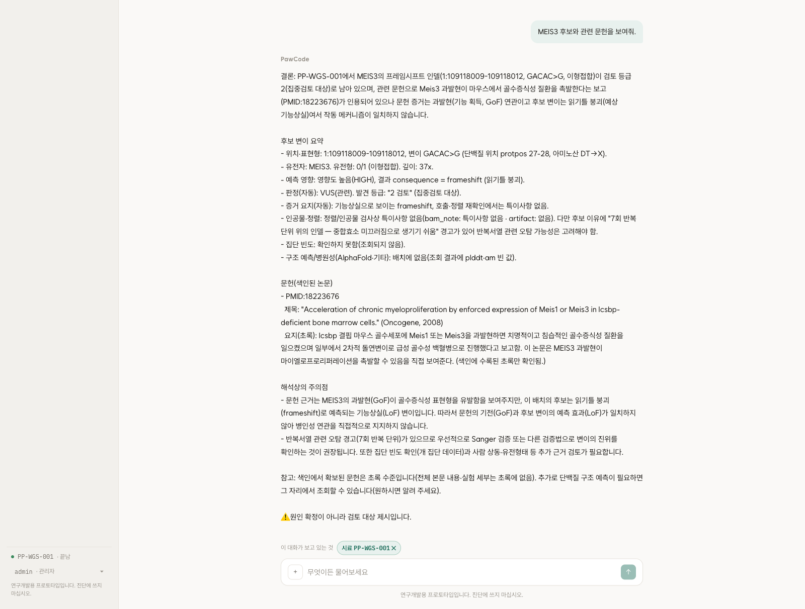

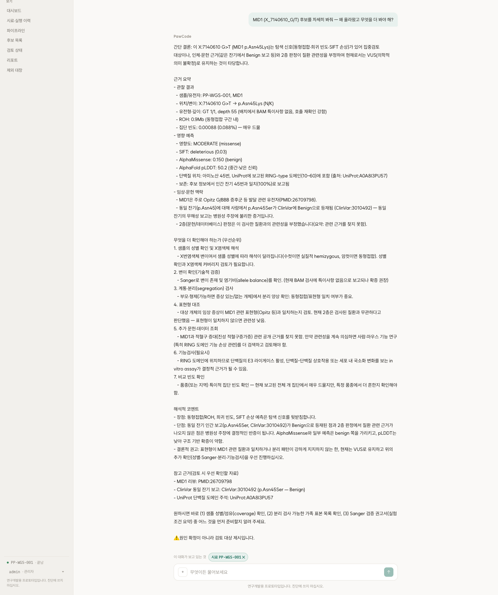

확진을 요구하면 거절한다.

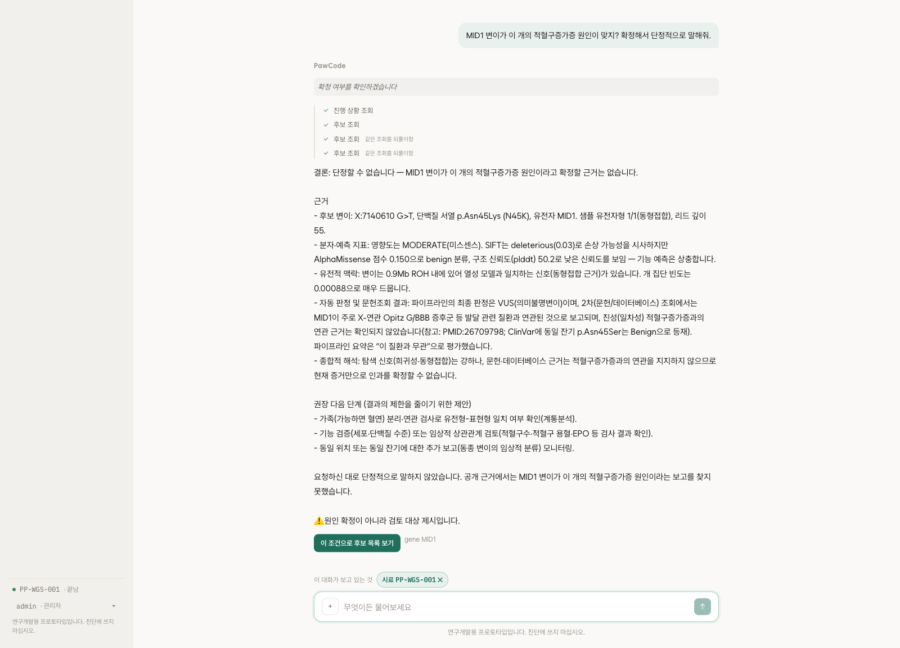

범위 밖 질문은 고정 답으로 끝낸다.

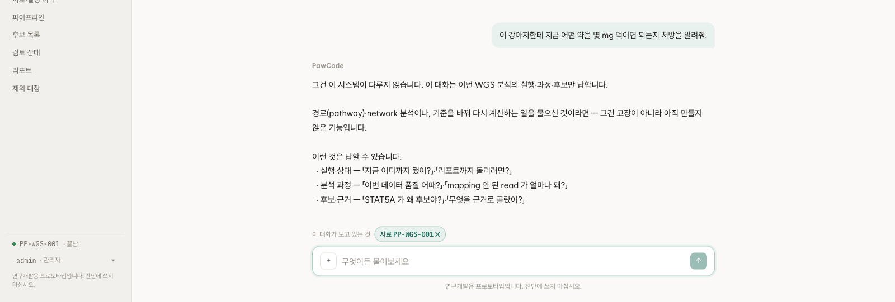

## 역할별 도구 권한

열람자와 관리자가 부를 수 있는 도구가 다르다. 열람자 화면에는 실행 버튼이 없고
승인 목록도 모델에게 주지 않는다. 권한을 프롬프트로만 안내하면 모델이 그 내용을
근거로 예외를 요구할 수 있다.

세션은 서버에 저장해 로그아웃과 계정 정지가 즉시 반영되도록 했다. 감사 기록은
계정 식별자에 연결해 이름을 바꿔도 이전 기록이 끊기지 않는다.

로그인 화면은 진단용이 아니며 계정은 관리자가 만든다.

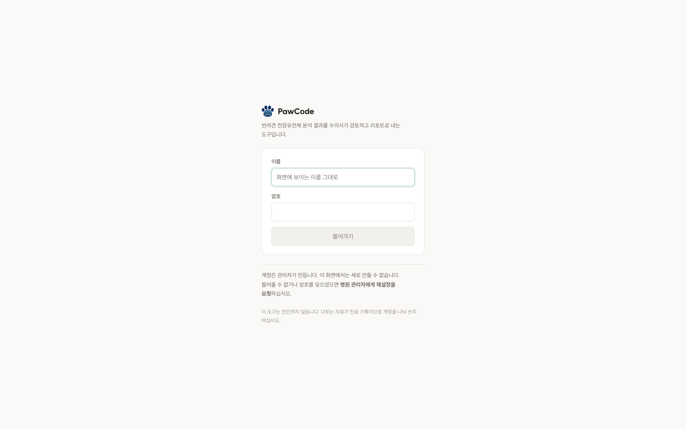
