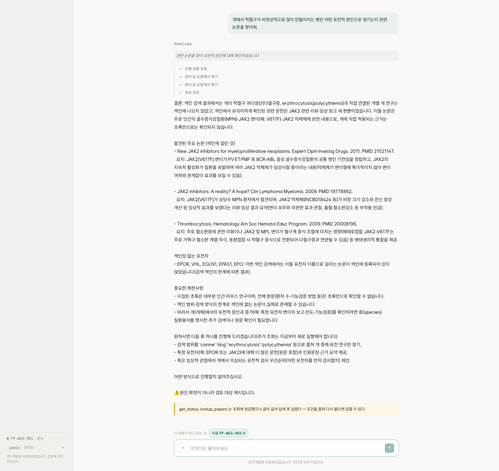
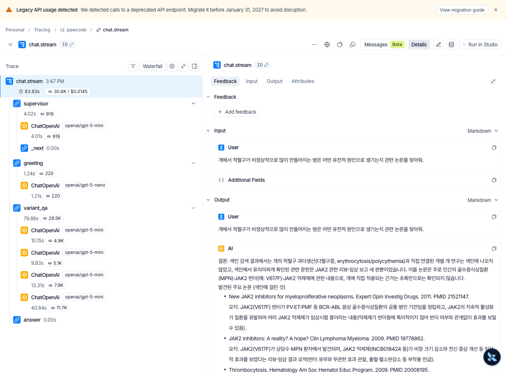

# 문헌 검색과 평가

2층 판정에서 인용한 논문을 색인했다. 챗봇은 이 색인에서 근거를 찾아 답한다.
처음에는 색인 규모가 작아 낱말 검색(BM25)만 썼다. 벡터 검색의 성능은 아직
측정하지 않았고 임베딩 모델을 추가로 준비해야 하는 부담도 있었다.

증상을 말하면 관련 문헌을 찾아 답변에 붙인다.



## 유전자명 기반 검색

첫 평가 기준을 설계하는 일은 AI에게 맡겼다. AI는 유전자 이름을 질의로 만들고,
같은 유전자를 언급한 논문을 기준 논문으로 삼았다.

```
질의 생성: 유전자 이름 검색
질의:      EPAS1
정답 기준: 기준 논문 선정
정답:      EPAS1을 언급한 논문
```

첫 평가에서는 질의와 정답에 같은 유전자명이 들어갔다. BM25에 유리한 조건이었고,
유전자명을 모른 채 증상과 생물학적 현상으로 묻는 경우는 반영하지 못했다. 이때 나온
97.7%만으로 낱말 검색이 충분하다고 보기는 어려웠다.

MeSH 평가도 질의와 문서에 같은 개념어가 들어갔고, 문서의 MeSH에는 가중치를 3배
주었다. 양쪽에서 MeSH를 빼자 적중률은 88.4%에서 44.8%로 떨어졌다.

## 자연어 기반 검색

유전자명이 없는 질의로 평가하려고 논문 40편을 무작위로 뽑아 제목만 모델에게 주고 "이 논문을
찾고 싶은 사람이 할 법한 질문"을 만들게 했다. 유전자 이름과 제목의 전문용어를
그대로 옮기지 못하게 했고, 정답은 그 논문 한 편으로 두었다.

색인이 2,655편이던 때의 결과이다.

| 질의 | BM25 | 벡터 | 혼합(RRF) |
|---|---|---|---|
| 한국어 그대로 | 0% *(40건 중 39건이 0건)* | 15% | 15% |
| 영어 그대로 | 82.5% | 87.5% | 87.5% |
| 실제 경로 (모델이 검색어 추출) | 90.0% | 85.0% | 92.5% |
| 참고: 제목 그대로 (상한선) | 100% | 100% | |

*Hit@10 기준. 질의마다 기준 논문 한 편을 두고, 상위 10개 결과 안에 그 논문이
포함됐는지를 셌다.*

질의 성격에 따라 결과가 갈렸다. 유전자 심볼처럼 낱말이 정확한 질의는 BM25가,
모호한 문장은 벡터가 높은 값을 보였다. 그래서 둘을 섞는
[RRF](https://research.google/pubs/reciprocal-rank-fusion-outperforms-condorcet-and-individual-rank-learning-methods/)를
골랐다.

## 색인 확장과 적중률

여기까지가 2,655편 기준이다. 판정이 인용한 논문만 모은 색인이라 질문이 그 밖으로
나가면 관련 논문을 찾을 수 없었다. 확장 검색으로 74,876편을 더해 77,531편으로
키웠다.

같은 질의 40건을 다시 던지자 적중률이 낮아졌다.

| 질의 | 2,655편 | 77,531편 |
|---|---|---|
| 실제 경로 · BM25 | 90.0% | **60.0%** |
| 실제 경로 · 혼합 | 92.5% | **60.0%** |

벡터 단독(당시 모델 MiniLM 기준)은 47.5~52.5%였다. 2,655편의 영어 자연어
질의에서는 BM25보다 높았지만(87.5% 대 82.5%) 색인을 늘린 뒤에는 결과가 달라졌다. 후보가 30배로 늘면 비슷한 논문도 함께 늘어난다. 작은 색인에서
나온 수치를 확장된 색인에 그대로 적용할 수 없었다.

## 임베딩 모델 비교

세 모델을 같은 질의 40건으로 비교했다. 모두 77,531편 기준이다.

| 질의 | MiniLM(384) | 3-small(1536) | 3-large(3072) |
|---|---|---|---|
| 실제 경로 · 벡터 | 52.5% | 55.0% | 70.0% |
| 영어 자연어 · 벡터 | 47.5% | 52.5% | 80.0% |
| 한국어 · 벡터 | 0% | 0% | 45.0% |

`text-embedding-3-large`를 골랐다. 한국어 적중률이 0%에서 45.0%로 올랐고,
3-small은 MiniLM과 2.5%p 차이였다.

같은 한국어 질문에 대한 검색 결과를 비교했다.

```
질문: 뒷다리에 힘이 빠지는 증상과 관련된 논문 근거가 있어?

전(MiniLM)  Korean cohorts 성격 GWAS · Letter from Sri Lanka
후(Large)   SGCD 결손 → limb girdle muscular dystrophy (PMID 28697784)
            SGCD missense variant (Lagotto Romagnolo)
```

검색 왕복은 310ms에서 1,020ms로 늘었고, 색인을 새로 만드는 데
₩4,700이 들며 질의마다 외부 API를 부른다. 재현 시 외부 서비스에 의존하므로
어느 경로로 만든 임베딩인지를 메타에 남긴다.

## 문장형 검색어

실제 검색은 "한국어 질문 → 모델이 영어 검색어 추출 → 검색" 순서로 진행된다.
생성된 검색어를 확인하니 질문과 무관한 유전자 이름을 넣는 경우가 있었다.

```
Rab30 논문   → "AMPK SIRT1 ATGL fasting metabolism"    ← Rab30 이 아니다
Cyp2s1 논문  → "bile salt hydrolase microbiome"         ← 틀렸다
```

원인은 도구 설명이었다. "유전자 이름을 알면 반드시 넣는다"고 시켜 두어서, 모르는
자리에서도 그럴듯한 이름을 채우고 있었다. 설명을 "낱말을 나열하라"에서 "영어
문장으로 쓰라"로 바꾸고 같은 질의 40건을 다시 쟀다.

| 실제 경로 | 옛 프롬프트 (키워드) | 새 프롬프트 (영어 문장) |
|---|---|---|
| BM25 | 57.5% | 67.5% |
| 벡터 | 70.0% | 82.5% |
| 혼합 | 67.5% | **90.0%** |

지시를 빼자 유전자 이름을 만드는 오류도 사라졌다. 벡터 검색은 낱말을 나열한 질의보다
문장 질의에서 적중률이 높았다. BM25 적중률도 함께 올랐고 혼합 검색에서 가장 높았다.

사람이 직접 쓴 영어 문장(77.5%)보다 모델이 만든 검색어가 높게 나온 것도 이 측정에서
확인했다. 도메인 용어를 넣어 다듬기 때문이다.

평가 결과는 다음과 같이 바뀌었다.

```
2,655편  · MiniLM · BM25           90.0%
77,531편 · MiniLM · 혼합           60.0%   ← 색인 30배 확장
77,531편 · Large  · 혼합 · 키워드   67.5%
77,531편 · Large  · 혼합 · 문장     90.0%
```

관련 논문을 찾아도 챗봇이 잘못 요약하면 답변에 오류가 생긴다. 검색 평가만으로는
답변의 정확성을 확인할 수 없다. 답변 생성 단계의 대응과 한계는
[가드레일](06-ai-operations.md)에 적었다.

문헌 검색은 대화 경로 중 가장 길다. 트레이스에서 확인한 사용량은 30.6K 토큰이다.
후보 근거 질의는 26.9K 토큰이었다.



## 장애 시 로컬 검색 전환

벡터 저장소는 Milvus로 옮겼다. 분석 서버의 CPU와 메모리를 파이프라인에 남겨
두기 위해서였다. 로컬 낱말 검색도 유지하며 다음 기능을 사용한다.

```
제목과 주제어에 준 가중치     본문보다 무겁게 본다
어간 처리를 하지 않는 것      EPAS1 이 epa 로 잘리는 사고를 막는다
왜 0건인지를 가르는 것        색인이 빈 것 · 인용이 없는 것 · 한국어인 것
```

색인이 비어서 못 찾은 것과 조회 결과가 0건인 것을 구분한다. 외부 서비스가 막히거나
한도를 넘으면 로컬 검색으로 전환한다.

## 평가의 한계

이번 평가의 정답은 MeSH·인용 유전자·논문 자체이지 사람이 매긴 적합도가 아니다.
질의 40건은 적고, 모델이 제목을 보고 만든 합성 질의이다. 정답을 한 편씩 두었기
때문에 관련 논문이 여럿인 상황은 재지 못했다.

다음 평가에는 실제 사용자의 질문을 사용하려 한다.
→ [추가 개발 계획](08-next-steps.md)
