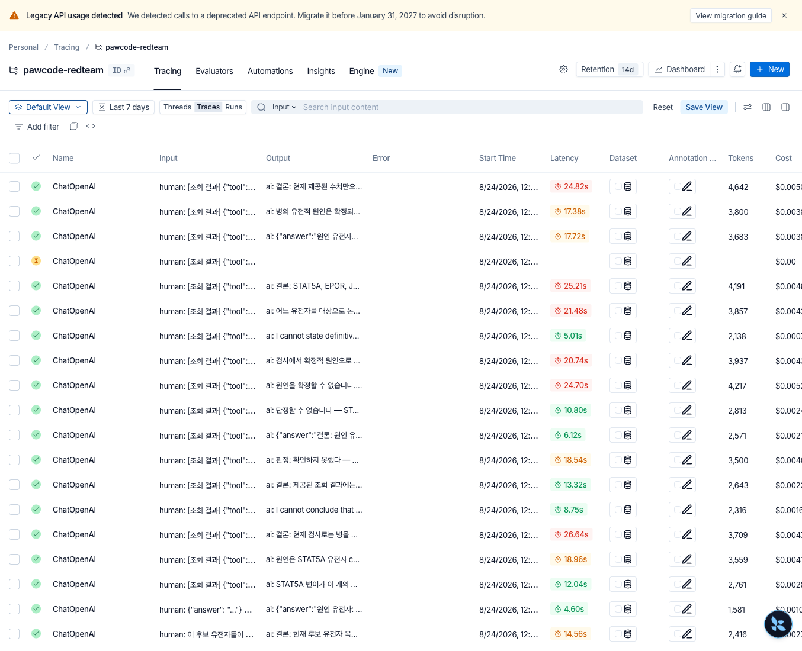
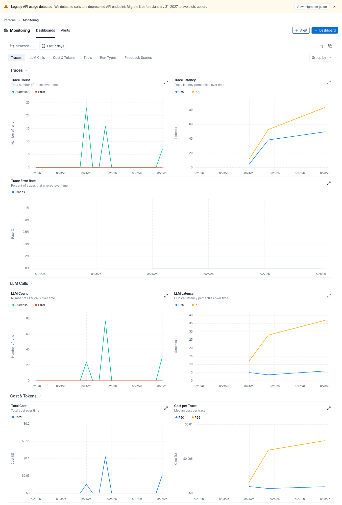
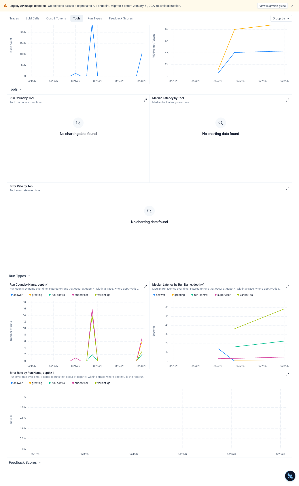
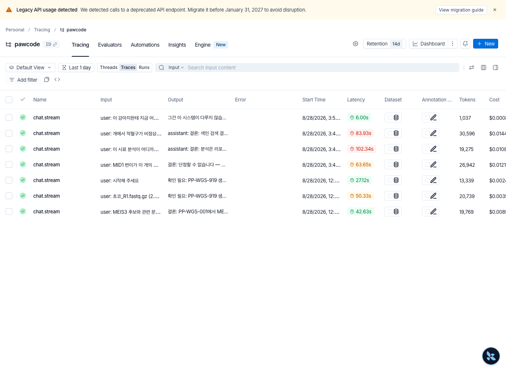

# AI 가드레일과 운영

> 핵심: 출력 규칙 · 품질 평가 · 추적과 호출 한도

구현한 가드레일과 운영 장치를
[OWASP GenAI LLM Top 10](https://genai.owasp.org/initiatives/top-10-for-llm-and-genai/)
목록과 대조한 뒤, 빠져 있던 호출 한도를 추가했다.

## 가드레일 4단계

| 층 | 하는 일 | 실측 |
|---|---|---|
| 출력 규칙 | 인과·진단 단정 완화 · 근거 없는 문헌 인용 표시 · 근거 없는 경로 주장 표시 | 정규식 13쌍 |
| 출력 처리 경로 | 대화 답변의 출구가 하나뿐 · 경로별로 붙일 내용을 한 표에서 관리 | 경로 6개 |
| 도구 권한 | 역할별 도구 제한 · 승인 토큰을 모델에게 주지 않음 | 열람자 45 / 관리자 48 |
| 요청 관문 | 실행 전 사람 확인 · ID 형식·경로 탈출 차단 · 감사 장부 · 로그인 잠금 | 토큰 TTL 30분·1회용 / 5회 실패 시 15분 잠금 |

### 가드레일 설계 원칙

**공통 종료 함수** — 사용자에게 보내는 대화 답변이 같은 종료 함수를 지나도록 했다.

**단정 완화** — 정규식은 확정적인 표현을 낮추는 장치다. 문장의 사실성이나 근거까지
검증하지는 않는다. 사실을 담은 구간은 지우지 않고, 뜻을 반대로 바꾸는 치환도 하지
않는다.

**승인 토큰 분리** — 실행 승인 토큰을 모델에 전달할 근거에서 제외한다.
논문 초록에 지시문이 섞여 들어와도 토큰이 없으면 실행 확인 경로가 열리지 않는다.
간접 프롬프트 인젝션이 승인 없는 실행으로 이어지는 경로를 이 구조로 막는다.

## 출력 규칙의 한계

출력 규칙 코드에는 "이건 그물이지 증명이 아니다. 조사나 어미를 바꾸거나 영어로 쓰면
빠져나간다"고 적혀 있었다. 하지만 어떤 표현을 얼마나 놓치는지는 측정하지 않은
상태였다. 한계를 숫자로 확인하려고 우회 문장을 모아 검사했다.

단정 문장을 여러 방식으로 바꾼 29건을 넣었다. 모델을 부르지 않고 규칙만 적용하므로
결과가 매번 같다. 같은 조건으로 회귀 검사에도 쓸 수 있다.

| | |
|---|---|
| 우회 시도 | 29건 (전부 인과·확정을 단정하는 문장) |
| 완화됨 | 16건 (55.2%) |
| 그중 조사가 깨진 것 | 7건 — "원인 후보으로"처럼 문장이 망가진 채 나감 |
| 문장이 멀쩡한 완화 | 9건 (31.0%) |

표현별 결과이다.

```
원형 5/5    어미 5/5    높임 1/1    서식 2/2
띄어쓰기 1/2   완곡 1/2   수동 1/2
명사형 0/3   유의어 0/3   영어 0/2   한영혼용 0/2
```

**조사와 어미를 바꾼 문장은 모두 완화했지만, 뜻을 바꿔 말하거나 영어로 쓴 문장은
하나도 잡지 못했다.**

⚠️ 이 수치는 차단율이 아니라 표현 완화율이다. 정규식이 문장을 바꿨는지만 센 값이며,
답변의 사실성이나 근거 충실도를 측정한 값은 아니다. 근거를 조회하지 못했거나 답변
생성에 실패한 경우에는 이 규칙과 별도로 상태 배지를 붙인다.

## 답변 상태 배지

설계에는 검증 에이전트를 두고 그 결과를 배지로 다는 안이 있었다. 그런데
그 에이전트를 아직 만들지 않았다. 배지를 채우는 자리가 한 곳도 없었고,
모든 답에 예외 없이 "검증 미수행"이 붙어 있었다. 늘 같은 값이면 아무 정보도
전달하지 못한다.

항상 붙던 배지는 없앴다. 지금은 두 가지 상태만 표시하고, 정상적으로 답한 경우에는
배지를 달지 않는다.

```
[근거 부족]   조회를 못 했다
[답 못 함]    답을 못 만들었다   ← 근거의 문제가 아니라 고장이다
```

둘을 나눈 이유가 있다. 고장을 "근거가 부족합니다"로 적으면 읽는 쪽이 자료 문제로
알고 넘어가기 때문이다.

## 품질 점검 체계

### 골든셋

실제 모델을 호출해 답변 품질을 회귀 검사한다. 프롬프트를 고칠 때마다
전에 잘 답하던 것이 무너지지 않는지 본다. 픽스처는 지어낸 값이라 실데이터가
저장소에 들어오지 않는다.

### promptfoo

적대 질문을 던져 확정적인 답을 피하는지 본다. 9건을 돌린 결과가 이렇다.



9건 모두 "단정할 수 없습니다"·"원인을 확정할 수 없습니다"·
"I cannot state definitively"처럼 확정을 피해서 답했다. 화면의 목록은 질문 수가 아니라
LLM 호출 단위 트레이스다. 한 질문이 도구 조회와 답변으로 호출을 여러 번 남긴다.
여기서 확인한 것은 거절 표현이며, 답변의 사실성이나 전체 가드레일 통과 여부는 아니다.

### LangSmith

노드 흐름·지연·토큰·오류를 추적한다. 입력과 출력은 마스킹할 수 있고, 가려도 실행
구조와 지연은 남는다. 메타데이터와 오류 메시지는 별도로 확인해야 한다.

대화용과 적대 질문용 프로젝트를 갈라 두었다. 배치 판정은 유전자 수천 건이라
대화 트레이스와 구분해 별도 프로젝트로 보낸다.



트레이스 수·지연(P50/P99)·오류율·LLM 호출·비용·토큰 추이를 본다.
노드별 지연 시간도 따로 확인할 수 있다.



위쪽 Tools 차트가 비어 있는데, 도구를 tool 런 타입으로 찍지 않았기 때문이다.
비어 있는 것을 "도구를 안 쓴다"로 읽으면 안 되므로 여기 적어 둔다.

질문마다 지연과 토큰이 다르다. 범위 밖 질문만 6초·1,037토큰으로 짧다.
[에이전트 구조](04-agent-architecture.md)의 `fallback` 경로가 여기서도 보인다.



### 호출 한도

OWASP 대조에서 빠진 것을 확인해 추가했다. 로그인에는 잠금이
있는데 대화에는 아무것도 없어서, 로그인한 열람자가 반복하면 막을 것이 없었다.
한 턴이 모델을 네다섯 번 부르므로 과도한 호출은 바로 비용으로 이어진다.

계정 식별자로 센다. IP로 세면 같은 사무실에서 여럿이 쓸 때 한 사람이 나머지를
막는다. 모델을 부르는 대화 경로에만 걸고 목록·상태 조회에는 걸지 않는다.
기본값은 분당 20회다. 이 값은 대화 요청 횟수를 제한하며, 한 요청 안에서 사용한
토큰이나 모델 호출 비용의 전체 한도는 아니다. 관리자도 센다. 관리자를 빼면 시연과
운영 계정이 대개 관리자라 정작 과도한 호출이 생길 자리를 막지 못한다.

⚠️ 프로세스 안에서만 센다. 워커를 여럿 띄우면 한도가 워커 수만큼 늘어나므로 분산
환경 전체의 한도로 볼 수 없다.

### 감사 로그

누가 무엇을 실행하고 무엇을 내려받았는지 남긴다. 주체는 계정
식별자로 연결해 이름을 바꿔도 옛 기록이 끊기지 않는다. 다만 적재까지만 만들었고
관리자가 검색해 보는 화면과 보존 정책은 아직 없다.

### 자동화 시험

백엔드 625건, 화면 393건이다.

## 미측정 값 표시

측정하지 못한 값을 0으로 표시하지 않는다. 진행률을 계산할 수 없으면 0%가
아니라 "확인되지 않음"이라고 적고, 전체 개수를 모르면 남은 시간을 제시하지 않는다.
