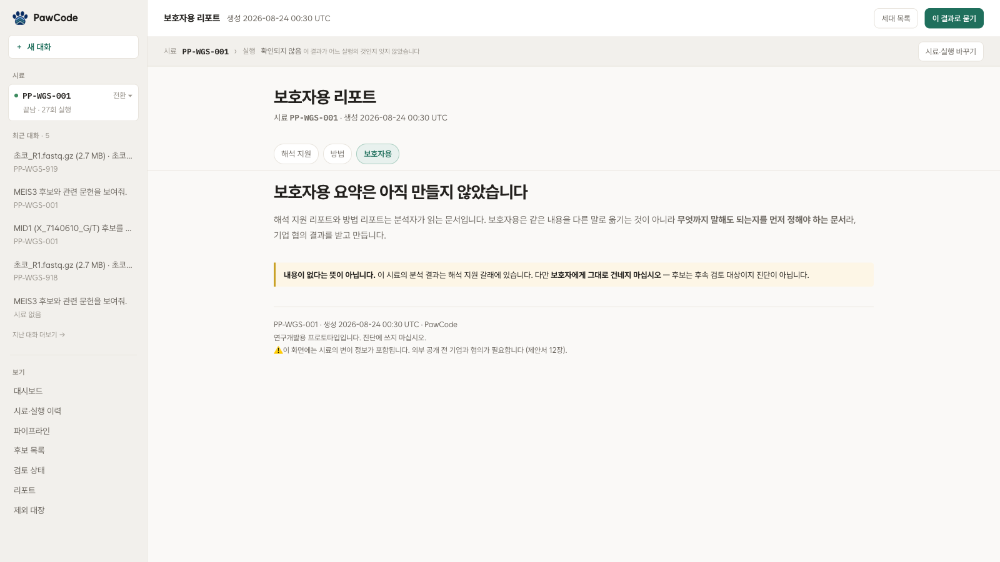

# 분석 결과 검토

4주 동안 분석 결과와 화면을 검토하면서 확인한 내용을 모았다.

## 측정 조건

1주차에 동형접합 기능상실 변이를 가진 유전자가 477개 나왔다. 후보로 보기에는
너무 많았다. 상위 후보들은 깊이와 품질 점수가 모두 높아 단순 필터로는 갈라지지
않았다.

측정 조건부터 확인했다. 참조 게놈은 개 한 마리를 기반으로 만들어졌고
주석에는 자동 예측한 전사체가 섞인다. 참조 개체의 염기나 주석 차이가 후보로
잡힐 수 있다는 뜻이다. 다른 참조 셋과 교차 확인한 자리 9,906개 중 3,605개(37%)가
참조 차이 후보로 갈렸고, 유전자 477개는 62개로 줄었다.

이후에도 전부 통과하거나 전부 실패하는 결과가 나오면 판정 전에 설정을 확인했다.

## 산출물 생성과 조회

실행 완료 여부와 산출물을 읽을 수 있는지를 따로 확인했다. 구조 변이 검출은
1시간 27분 만에 끝났지만 변환 단계에서 실패했다. 단계 등록이 안 돼 같은 종류의 실패가
다섯 번 반복된 뒤, 산출물의 출처와 상태를 다섯 갈래로 나눠 기록했다.
→ [파이프라인 설계](02-pipeline-design.md)

## 판정 근거의 해석

판정 기준 원문을 대조해 넷을 고치니 LB 111건이 0건이 됐다. 등급이 사라진 것처럼
보이지만, 그 111건은 "양성이라는 근거가 있다"가 아니라 "보존도가 낮고 반복 구간이다"
뿐이었다.

수의사가 이를 양성 가능으로 읽으면 검토 대상에서 뺄 수 있어 해당 기준을 제외했다.

## 유전자명 기반 평가

첫 평가 기준 설계는 AI에게 맡겼다. AI는 유전자 이름을 질의로 쓰고 그 유전자를 언급한
논문을 정답으로 삼았다. 질의와 정답에 같은 낱말이 들어가 낱말 검색에 유리한 조건이었다.

유전자명을 뺀 자연어 질의로 다시 재니 검색 방식별 결과가 달라졌다.
→ [문헌 검색과 평가](05-rag-and-evaluation.md)

## 색인 규모와 적중률

같은 평가를 색인 2,655편에서 77,531편으로 옮기자 적중률이 90%대에서 60%로
떨어졌다. 검색 방식은 그대로였고 대상만 30배로 늘었다. 후보가 늘면 비슷한 논문도
함께 늘어난다.

작은 색인에서 측정한 적중률을 확장된 색인에 그대로 적용할 수 없어 성능을 다시 측정했다.

## 집계 단위

리드·변이·행은 각각 집계 대상이 달라 하나의 막대로 이으면 같은 단위처럼 보일 수 있다.
한 변이가 전사체마다 여러 줄이 되므로 행 수와 변이 수도 다르다.

합이 맞지 않는 자리도 있었다.

```
16,075 + 2,827 = 18,902     그런데 해석 대상은 18,853
```

한 변이의 어떤 행은 축에 걸리고 어떤 행은 안 걸려 49건이 양쪽에 모두 있다.
뺄셈으로 만들지 않고 리포트가 낸 합집합을 그대로 쓴다.

## 구현·측정 상태 표시

구현 여부와 측정 상태를 화면에 명시했다. 보호자용 요약은 탭만 있는 상태라
"아직 만들지 않았다"고 표시했다.



진행률을 못 재면 0%가 아니라 "확인되지 않음",
조회를 못 했으면 "0건"이 아니라 "조회 못 함"으로 표시한다.

## 근거 축 분리

후보를 검토할 때 선정 이유와 상충하는 근거를 함께 볼 수 있도록 했다.
후보 순위와 화면, 리포트 모두 근거를 합치지 않고 나란히 표시한다.
